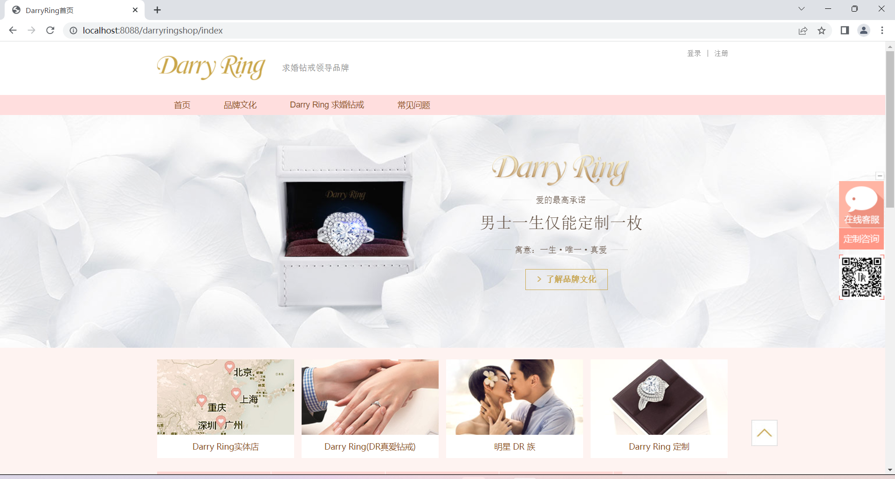
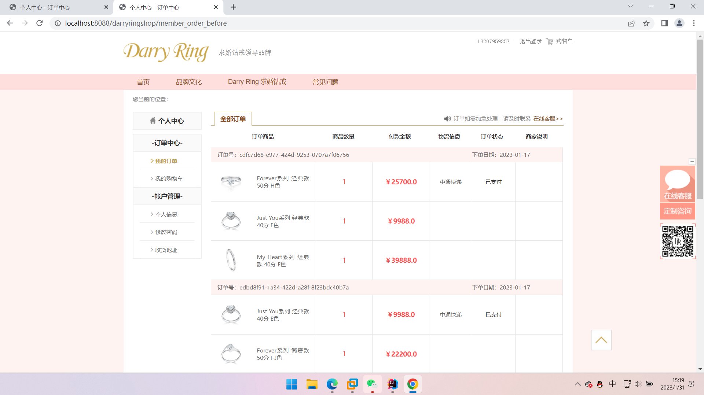

# 工程简介
 :star: :star: :star:   _**_大学生最喜欢的javaweb课设项目来啦！！！_ **_  :star:  :star:  :star: 

本项目后端 **基于SpringBoot2.4.2+Mybatis-Plus+Spring MVC** 。

前端使用 **Thymeleaf** 模板引擎。 **前后端不分离** ，前端html、css、js相关文件在resources文件夹下。

 _**如果这个项目有帮助到您，别忘了给我点点关注，给本项目上一个小star，谢谢大家！！！**_ 

附带sql文件自行导入吧，用的mysql5.7数据库

 **_请不要泄漏我的隐私，自己随便用可以，谢谢合作_** 

- 导入idea后，首先需要修改application.yml文件中的数据库配置。
- 之后启动项目，在谷歌浏览器输入[http://localhost:8088/darryringshop/index](http://)即可访问项目首页。
- 如需更改访问路径，请自行修改application.yml文件相关配置。

# 项目界面预览

